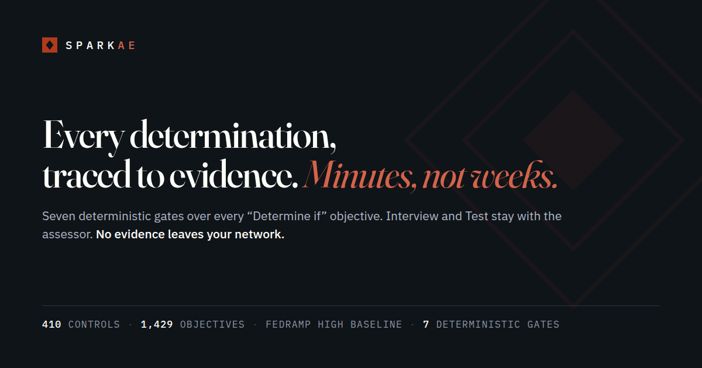

# SparkAE — public reference build

[](https://sparkae.ai)

**The public site and in-browser reference engine at [sparkae.ai](https://sparkae.ai).**
Open `demo-standalone.html`. No build, no server, no network.

SparkAE reads an assessment package, evaluates every “Determine if”
objective through seven deterministic gates, and shows precisely what
the evidence supports, contradicts, or fails to prove. Interview and
Test stay with the assessor. This repository is served as-is by Netlify
at **https://sparkae.ai** and is maintained here (see *How this
repository is maintained*).

## What is here, and what is not

| Ships in this repository (Apache-2.0) | Ships only in the SparkAE server product (commercial) |
|---|---|
| `demo-engine.js` — the deterministic 7-gate assessor: BM25 retrieval, concept coverage, evidence strength, ODP resolution, refutation / contradiction / draft detection, temporal coherence, determination | Multi-tenant API (`/v1/documents`, `/v1/assessments`), Postgres row-level security, hash-chained audit log |
| `demo-standalone-catalog.js` — NIST SP 800-53A Rev 5 determination statements with FedRAMP baseline tags | PDF and XLSX text extraction; Nessus / ZAP scan ingestion into POA&M |
| `demo-exports.js` — six builders: OSCAL 1.1.2 Assessment Results (JSON), findings CSV, RET CSV, POA&M CSV, TCW CSV, executive summary (text) — plus the reproducibility receipt | SAR / SAP DOCX, SRTM / CIS / CRM XLSX, OSCAL POA&M and the other server-side export formats |
| `demo-standalone.html` — the live demo (§01 runs the engine above; §02–§09 are labelled walkthroughs), `demo-20x.html`, the site pages, self-hosted fonts, per-page CSP | Optional LLM modes, integrations, the assessor console, ten analytical services |
| `tests/` — the conformance suite that CI runs on every push | The product test suite and Postgres/RLS suites (private; not a published count) |

This repository is **not** the SparkAE server product. There is no package
to install: no `pyproject.toml`, no Docker image, no `/v1` API.
`pip install .` from this checkout will not yield PDF/XLSX parsers, LLM
modes, or the assessor console.

The homepage in this tree is the marketing site for the commercial
product **and** the host of the browser demo. Treat `pip install`,
`FRAMEWORK=`, `localhost:8000/v1`, and Docker snippets on `index.html`
as server-product copy, not instructions for this repo. §02–§09 and
`demo-20x.html` are guided walkthroughs; they are not executed by
`demo-engine.js`.

The **Source** link on the site points here so that anyone can inspect exactly
how a verdict is reached and reproduce it offline. It does not demonstrate
the server product; nothing in this tree runs `pip install` or Docker.

## Run it

```text
open demo-standalone.html      # from disk (file://) or any static host
```

Choose the sample SSP or upload a package (`.zip`, `.docx`, `.txt`, `.md`,
`.csv`, `.json`, `.xml`, `.nessus` — PDF and XLSX are refused with a reason,
never guessed), pick the FedRAMP profile and the assessment date, and run.
The console reports only what was computed: files parsed and refused,
objectives adjudicated, gate tallies, verdicts, and the receipt below. It is
**automated EXAMINE preparation**; INTERVIEW and TEST are not performed and
remain with the assessor.

## The engine

Every determination statement passes through seven recorded gates, in order:

| # | Gate | Sub-checks |
|---|------|-----------|
| 1 | Presence | evidence above the BM25 relevance threshold |
| 2 | Concepts | concept coverage of the objective text ≥ 40% |
| 3 | Strength | 3a traceable references · 3b no keyword stuffing |
| 4 | ODP | organization-defined parameters resolved |
| 5 | Contradiction | 5a no refutation · 5b no self-contradiction · 5c no draft / placeholder markers |
| 6 | Temporal | 6a currency · 6b scan cadence · 6c no future-dated claims · 6d open-finding SLA |
| 7 | Determination | Satisfied only if gates 1–6 all passed |

A result's `gates` array holds one record per gate reached and nothing else,
so a Satisfied verdict always carries exactly seven passing records. Every
result reports `assessment_method: EXAMINE`, the `assessment_date` it was
given, an evidence-support score (`confidence`), a defensibility score
(an internal finding-trace rubric — not a measure of assessor acceptance),
and `review_required` when a Satisfied verdict rests on thin support
(confidence or concept coverage below 60%).

Retrieval is lexical BM25 (k1 1.5, b 0.75) — there are no embeddings and no
vector store in this build. Contradiction and draft detection are
pattern-based indicators. Thresholds are constants in `demo-engine.js` and
are hashed into the ruleset digest.

## Determinism, precisely

The engine reads no clock and uses no randomness: `assessDif` *requires* an
assessment date and throws without one, and the exporters derive every UUID
(RFC 4122 v5) and timestamp from the run rather than from `crypto` or the
wall clock. `CONTRIBUTING.md` forbids `Date.now()`, argument-less
`new Date()` and `Math.random()`, and `tests/check.mjs` fails if either
script contains them.

Two runs agree when this **reproducibility tuple** agrees:

```text
engine version · catalog digest · ruleset digest · evidence digest · assessment date
```

Every run emits a receipt naming all five and the resulting **verdict
digest**; every OSCAL document carries the same receipt in `metadata.props`.
Build the same run twice and the files are byte-identical — check with
`sha256sum`. What is *not* promised: two different assessment dates give
different temporal verdicts (that is the point of the date), and the
walkthrough animations' timing is decorative.

The bundled sample (`CloudVault-Federal-SSP.txt`, FedRAMP Low profile,
assessed as of 2026-06-01) is the golden fixture: `tests/golden/sample-ssp.expected.json`
pins its counts and digests, and CI fails on any drift.

## Catalog

| Scope | Controls | Determination statements |
|---|---:|---:|
| Complete NIST SP 800-53A Rev 5 catalog | 447 | 1,513 |
| FedRAMP High profile | 410 | 1,429 |
| FedRAMP Moderate profile | 323 | 1,307 |
| FedRAMP Low profile | 156 | 981 |

Catalog version `2026-07-21` · digest `91ad1b17138f`. Both travel in the
reproducibility receipt of every artifact the engine emits, and the digest is
the SHA-1 of the catalog object's canonical JSON, so a regenerated catalog is
visible in everything it produced. The golden fixture pins both, and CI fails
on either drifting.

OSCAL: the exporter emits **NIST OSCAL 1.1.2** and CI validates the output
against the official NIST 1.1.2 assessment-results schema vendored in
`tests/schema/`. SparkAE's own metadata props (the reproducibility receipt)
use the namespace `https://sparkae.ai/ns/oscal`. The package-validator
walkthrough (§07) applies FedRAMP constraint checks that accept OSCAL 1.0.4
or later.

## Verify it yourself

```bash
node tests/check.mjs .                 # node ≥ 18, no dependencies
pip install jsonschema regex && python tests/check_oscal_schema.py
```

There are also four browser-level checks — `node tests/browser.mjs .`,
`node tests/assessor.mjs .`, `node tests/selections.mjs .` and
`node tests/pages.mjs .`, after
`npm i playwright && npx playwright install chromium` (CI's `browser` job runs
all four). The first three drive the demo in headless Chromium with every
non-file request aborted. `pages.mjs` serves the whole tree over a local HTTP
server and opens every published page, because a page that throws on load
would otherwise ship green: `check.mjs` only parses the inline scripts, and
until this existed no page but the demo was ever executed. It asks the least a
visitor is owed — the page renders, it does not throw, it reaches no other
origin, and every internal link resolves. `browser.mjs` compares what the
page shows and downloads with the golden fixture. `assessor.mjs` covers the
assessor layer: that each finding's examine statement is built from the run
rather than asserted, that revising a determination reaches the OSCAL, POA&M,
RET and summary, and that doing so leaves the reproducibility receipt
untouched. `selections.mjs` covers the controls themselves — the nine tabs, the
rail, and the filter chips — and asks of each selection whether it does what
its label says: that a tab switches the console to its own configuration, that
a rail entry §01 cannot assess says so before Run is pressed and names the
system when it stops, that the rail's control counts are the ones this catalog
yields, that every chip on offer matches rows of its own value and every value
in the run is on offer, that changing a filter mid-paint leaves none of the
previous selection's rows behind, and that a selection matching nothing says
which selection emptied the table.

`check.mjs` checks: every script parses; the catalog counts above; no
published file loads or calls a third-party origin and every page's CSP is
`connect-src 'self'`; no clock or randomness in the engine or exporters; the
gate model; determinism (same input twice → same verdict digest and
byte-identical OSCAL; a missing date throws; a different date changes the
temporal verdicts); the golden fixture; CSV formula-injection safety; the
OSCAL document's shape and receipt; that every page names one address in its
`canonical`, its `og:url` and `sitemap.xml`, and that Netlify's Pretty URLs
post-processing stays pinned off; and that the homepage hero labelled
“from the sample run” is a finding this engine actually emits for that
run, shown in the OSCAL shape the exporters write. The GitHub Actions
workflow in `.github/workflows/ci.yml` runs both on every push.

## How this repository is maintained

**This repository is the public face, and it is authoritative for it.**
What is here is what https://sparkae.ai serves: changes are made, reviewed
and merged here, and the deploy follows from `main`. Open an issue or a pull
request and it lands in the thing you are looking at. Contributions are
welcome under the constraints in `CONTRIBUTING.md`.

The SparkAE server product is developed in a separate private repository and
is not published. That is a different codebase, not an upstream of this one —
the table at the top of this README says which capabilities live where.

`CHANGELOG.md` records what moved and, for each change, whether the sample's
verdict digest moved with it.

Hosting: `netlify.toml` publishes the repository root with no build step,
`_headers` sets a per-page Content-Security-Policy and the usual security
headers, and `_redirects` provides the forced `/demo` short link.

**Served as-is** is meant literally, and it is a claim about the deployed site
rather than about these files, so it has its own check:

```bash
node tests/check_published.mjs          # or --site <deploy-preview-url>
```

It fetches every published file from `https://sparkae.ai` and compares the
bytes with the working tree, then confirms `/` is `index.html`, that `/demo`
and `/3pao.html` are still 301s, that Netlify's own config files are not
served as content, and that the security headers and the per-page
Content-Security-Policy are the ones the host actually returns — `_headers` is
a statement of intent, and this is the only check that reads the wire.

It also asks whether anything *unpublished* is really gone. The file comparison
walks this repository, so it can only ask whether a file that exists here is
served correctly; a file live on the site but deleted from this tree is
invisible to it. Paths that must stay gone are listed in `MUST_NOT_BE_SERVED`
at the top of the script.

Run it from a checkout of the commit that was deployed — a tree ahead of the
last deploy differs for the ordinary reason.

This is the only check here that uses the network, so it is not part of
`tests/check.mjs` and not a merge gate; CI runs it weekly and on demand.

It exists because the claim was false and nothing noticed. Netlify's Pretty
URLs post-processing is on unless a project says otherwise, and it rewrites the
*published* HTML — every internal `href="x.html"` is served as `href='/x'` — so
all seven pages differed from the files here, and the site's own links pointed
at addresses its `canonical` tags disclaim. `netlify.toml` now pins it off, and
`tests/check.mjs` fails if that pin goes away. Netlify still answers both `/x`
and `/x.html`, so anything already linking the extensionless form keeps
landing; the site just no longer emits it.

## Licence

**This repository** — the in-browser engine, the 800-53A catalog, the export
builders, the site pages and the tests — is licensed under the Apache License,
Version 2.0. See `LICENSE` and `NOTICE`. Contributions are inbound under that
same licence, by operation of Apache-2.0 section 5, unless a contributor states
otherwise in writing.

**The SparkAE server product** — the API, the multi-tenant service, the audit
chain, the integrations and the assessor console — is separate commercial
software. It is not in this repository, it is not covered by the Apache
licence, and it is licensed, not sold, under its own written agreement.

### U.S. Government users

Both are **commercial computer software** and **commercial computer software
documentation** as those terms are defined at FAR 2.101. Consistent with
FAR 12.212 (civilian agencies) and DFARS 227.7202-1 through 227.7202-4 (DoD),
the Government acquires each only under the licence customarily provided to the
public: for this repository, the Apache License 2.0 in `LICENSE`; for the server
product, its written commercial agreement. Use, duplication, disclosure,
modification and release are governed by those licences and no others.

Nothing in this README, on sparkae.ai, or in any SparkAE marketing material is
the licence or modifies it. Where this page and a licence differ, the licence
governs. A federal acquisition is made under the written agreement executed for
it, not under this section — read it with your counsel and your contracting
officer.

### Government and third-party material

NIST SP 800-53 Rev 5 and SP 800-53A Rev 5 catalog text, and the OSCAL 1.1.2
schema vendored in `tests/schema/`, are works of the United States Government
and are not subject to copyright in the United States (17 U.S.C. § 105). The
IBM Plex and Fraunces typefaces in `static/fonts/` are distributed under the SIL
Open Font License 1.1 — the licence texts travel with the files there.

SparkAE and the SparkAE marks are reserved. Contact:
[info@sparkae.ai](mailto:info@sparkae.ai).
